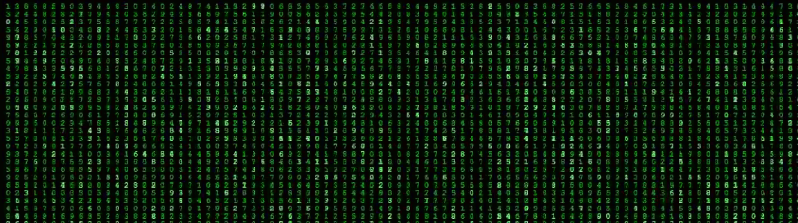

# Hi✋, I am Rohit Goswami

Welcome to my GitHub landing page! This repository serves as a showcase for my work as a Data Scientist and Software Developer. Here you will find a collection of projects, code samples, and tools that demonstrate my works on MACHINE LEARNING, PYTHON, JAVASCRIPT, HTML, CSS, and various other frameworks.

## ABOUT ME 

  
💼 I am currently pursuing my B.Sc in Data Science

📋I have a Diploma in Software Development. 
     
🤖 I have a solid foundation in machine learning algorithms, statistical analysis, and data visualization techniques. 

💡 Alongside my technical skills, I am also proficient in Python, HTML, CSS and Javascript allowing me to create interactive and visually appealing data products.

✍ Currently I'm learning about AI and Deep Learning techniques.
  

  

# Skills

### Languages

### Databases

[Certification link: Mongodb University](https://ti-user-certificates.s3.amazonaws.com/ae62dcd7-abdc-4e90-a570-83eccba49043/0a82e84e-d3c7-529c-b06c-1b0ad5c5b329-rohit-goswami-c548a69b-8588-5727-a6f9-5eef2eb9d005-certificate.pdf)

### Machine Learning/Deep Learning

 

 

### Frameworks

### DV tools

## Contact Me
I am open to collaboration and exciting opportunities. If you have any questions, suggestions, or would like to discuss a potential project, feel free to reach out to me : rohitgo853@gmail.com

##
### Thank you for visiting my GitHub landing page!
##

